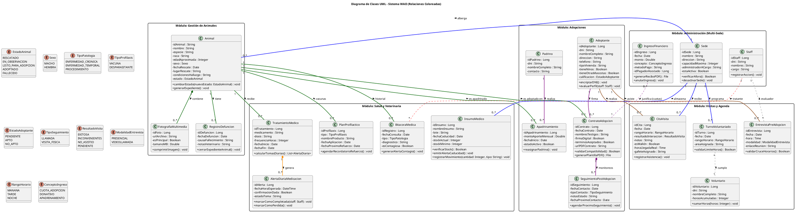

Class diagram:

```plantuml
@startuml Diagrama_Clases_WAO
skinparam classAttributeIconSize 0
skinparam monochrome false
skinparam roundcorner 10
skinparam packageStyle rectangle

' Opcional: linetype ortho hace que las líneas viajen en ángulos de 90 grados
' Descomenta la siguiente línea quitando la comilla simple si prefieres líneas rectas y cuadradas:
' skinparam linetype ortho

title Diagrama de Clases UML - Sistema WAO (Relaciones Coloreadas)

' ==========================================
' ENUMERACIONES (Tipos de datos predefinidos)
' ==========================================
enum EstadoAnimal {
  RESCATADO
  EN_OBSERVACION
  LISTO_PARA_ADOPCION
  ADOPTADO
  FALLECIDO
}

enum Sexo {
  MACHO
  HEMBRA
}

enum TipoPatologia {
  ENFERMEDAD_CRONICA
  ENFERMEDAD_TEMPORAL
  PROCEDIMIENTO
}

enum TipoProfilaxis {
  VACUNA
  DESPARASITANTE
}

enum EstadoAdoptante {
  PENDIENTE
  APTO
  NO_APTO
}

enum TipoSeguimiento {
  LLAMADA
  VISITA_FISICA
}

enum ResultadoVisita {
  EXITOSA
  INCONVENIENTES
  NO_ASISTIO
  PENDIENTE
}

enum ModalidadEntrevista {
  PRESENCIAL
  VIDEOLLAMADA
}

enum RangoHorario {
  MANANA
  TARDE
  NOCHE
}

enum ConceptoIngreso {
  CUOTA_ADOPCION
  DONATIVO
  APADRINAMIENTO
}

' ==========================================
' PAQUETE 5: ADMINISTRACIÓN (Bases del sistema)
' ==========================================
package "Módulo: Administración (Multi-Sede)" {
  class Sede {
    - idSede : Long
    - nombre : String
    - direccion : String
    - capacidadMaxima : Integer
    - administradorACargo : String
    - estaActiva : Boolean
    + verificarAforo() : Boolean
    + desactivarSede() : void
  }

  class IngresoFinanciero {
    - idIngreso : Long
    - fecha : Date
    - monto : Double
    - concepto : ConceptoIngreso
    - metodoPago : String
    - idPagadorAsociado : Long
    + generarReciboPDF() : File
    + anularIngreso() : void
  }

  class Staff {
    - idStaff : Long
    - dni : String
    - nombres : String
    - cargo : String
    + registrarAccion() : void
  }
}

' ==========================================
' PAQUETE 1: GESTIÓN DE ANIMALES
' ==========================================
package "Módulo: Gestión de Animales" {
  class Animal {
    - idAnimal : String
    - nombre : String
    - especie : String
    - raza : String
    - edadAproximada : Integer
    - sexo : Sexo
    - fechaRescate : Date
    - lugarRescate : String
    - condicionesHallazgo : String
    - estado : EstadoAnimal
    + cambiarEstado(nuevoEstado: EstadoAnimal) : void
    + generarExpediente() : void
  }

  class FotografiaMultimedia {
    - idFoto : Long
    - urlArchivo : String
    - esPrincipal : Boolean
    - tamanoMB : Double
    + comprimirImagen() : void
  }

  class RegistroDefuncion {
    - idDefuncion : Long
    - fechaDefuncion : Date
    - causaFallecimiento : String
    - notasVeterinario : String
    + cerrarExpedienteAnimal() : void
  }
}

' ==========================================
' PAQUETE 2: SALUD Y VETERINARIA
' ==========================================
package "Módulo: Salud y Veterinaria" {
  class BitacoraMedica {
    - idRegistro : Long
    - fechaConsulta : Date
    - tipo : TipoPatologia
    - diagnostico : String
    - esContagiosa : Boolean
    + generarAlertaContagio() : void
  }

  class PlanProfilactico {
    - idProfilaxis : Long
    - tipo : TipoProfilaxis
    - nombreProducto : String
    - fechaAplicacion : Date
    - fechaProximoRefuerzo : Date
    + agendarRecordatorioRefuerzo() : void
  }

  class TratamientoMedico {
    - idTratamiento : Long
    - medicamento : String
    - dosis : String
    - frecuenciaHoras : Integer
    - fechaInicio : Date
    - fechaFin : Date
    + calcularTomasDiarias() : List<AlertaDiaria>
  }

  class AlertaDiariaMedicacion {
    - idAlerta : Long
    - fechaHoraEsperada : DateTime
    - confirmacionDada : Boolean
    - estadoToma : String
    + marcarComoCompletada(staff: Staff) : void
    + marcarComoPerdida() : void
  }

  class InsumoMedico {
    - idInsumo : Long
    - nombreInsumo : String
    - lote : String
    - fechaCaducidad : Date
    - stockActual : Integer
    - stockMinimo : Integer
    + verificarStock() : Boolean
    + emitirAlertaCaducidad() : void
    + registrarMovimiento(cantidad: Integer, tipo: String) : void
  }
}

' ==========================================
' PAQUETE 3: ADOPTANTES Y ADOPCIONES
' ==========================================
package "Módulo: Adopciones" {
  class Adoptante {
    - idAdoptante : Long
    - dni : String
    - nombreCompleto : String
    - direccion : String
    - telefono : String
    - tipoVivienda : String
    - tieneNinos : Boolean
    - tieneOtrasMascotas : Boolean
    - calificacion : EstadoAdoptante
    + encriptarDNI() : void
    + evaluarPerfil(staff: Staff) : void
  }

  class ContratoAdopcion {
    - idContrato : Long
    - fechaContrato : Date
    - nombresTestigos : String
    - firmaDigital : Boolean
    - terminosAceptados : Boolean
    - urlPDFContrato : String
    + validarCompatibilidad() : Boolean
    + generarPlantillaPDF() : File
  }

  class SeguimientoPostAdopcion {
    - idSeguimiento : Long
    - fechaContacto : Date
    - tipoContacto : TipoSeguimiento
    - notasEstado : String
    - fechaProximoContacto : Date
    + agendarProximoSeguimiento() : void
  }

  class Padrino {
    - idPadrino : Long
    - dni : String
    - nombreCompleto : String
    - contacto : String
  }

  class Apadrinamiento {
    - idApadrinamiento : Long
    - montoAporteMensual : Double
    - fechaInicio : Date
    - estadoActivo : Boolean
    + reasignarPadrino() : void
  }
}

' ==========================================
' PAQUETE 4: VISITAS Y AGENDA
' ==========================================
package "Módulo: Visitas y Agenda" {
  class CitaVisita {
    - idCita : Long
    - fecha : Date
    - rangoHorario : RangoHorario
    - resultadoInteraccion : ResultadoVisita
    - notas : String
    - esWalkIn : Boolean
    - horaLlegadaReal : Time
    - gafeteAsignado : String
    + registrarAsistencia() : void
  }

  class EntrevistaPreAdopcion {
    - idEntrevista : Long
    - fecha : Date
    - hora : Time
    - modalidad : ModalidadEntrevista
    - enlaceReunion : String
    + validarCruceHorarios() : Boolean
  }

  class Voluntario {
    - idVoluntario : Long
    - dni : String
    - nombreCompleto : String
    - horasAcumuladas : Integer
    + sumarHoras(horas: Integer) : void
  }

  class TurnoVoluntariado {
    - idTurno : Long
    - fecha : Date
    - rangoHorario : RangoHorario
    - areaAsignada : String
    + validarLimiteHoras() : Boolean
  }
}

' ==========================================
' RELACIONES ENTRE CLASES (COLOREADAS)
' ==========================================

' Relaciones de la clase SEDE (Líneas AZULES fuertes)
Sede "1" -[#blue,bold]- "0..*" Animal : alberga >
Sede "1" -[#blue,bold]- "0..*" InsumoMedico : almacena >
Sede "1" -[#blue,bold]- "0..*" CitaVisita : recibe >
Sede "1" -[#blue,bold]- "0..*" TurnoVoluntariado : programa >

' Relaciones de la clase ANIMAL (Líneas VERDE OSCURO fuertes)
Animal "1" *-[#006400,bold]- "0..*" FotografiaMultimedia : contiene >
Animal "1" -[#006400,bold]- "0..1" RegistroDefuncion : tiene >
Animal "1" -[#006400,bold]- "0..*" BitacoraMedica : historial >
Animal "1" -[#006400,bold]- "0..*" PlanProfilactico : vacunas >
Animal "1" -[#006400,bold]- "0..*" TratamientoMedico : recibe >
Animal "1" -[#006400,bold]- "0..1" ContratoAdopcion : es adoptado en >
Animal "1" -[#006400,bold]- "0..*" Apadrinamiento : es apadrinado >

' Relaciones de SALUD Y VETERINARIA (NARANJA y líneas ROJAS punteadas)
TratamientoMedico "1" *-[#FF8C00,bold]- "0..*" AlertaDiariaMedicacion : genera >
BitacoraMedica "*" -[#red,dashed]- "1" Staff : tratante >

' Relaciones de ADOPCIONES y PADRINOS (MORADAS fuertes)
Adoptante "1" -[#800080,bold]- "0..*" ContratoAdopcion : firma >
ContratoAdopcion "1" *-[#800080,bold]- "0..*" SeguimientoPostAdopcion : monitoreos >
Padrino "1" -[#800080,bold]- "0..*" Apadrinamiento : realiza >
ContratoAdopcion "1" -[#800080,dashed]- "0..*" IngresoFinanciero : justifica (cuotas) >

' Relaciones del ADOPTANTE con VISITAS (Líneas MARRONES fuertes)
Adoptante "1" -[#8B4513,bold]- "0..*" CitaVisita : realiza >
Adoptante "1" -[#8B4513,bold]- "0..*" EntrevistaPreAdopcion : asiste >

' Relaciones del STAFF y VOLUNTARIOS (Líneas GRIS OSCURO punteadas)
EntrevistaPreAdopcion "*" -[#696969,dashed]- "1" Staff : evaluador >
TurnoVoluntariado "*" -[#696969,dashed]- "1" Voluntario : cumple >

@enduml
```
