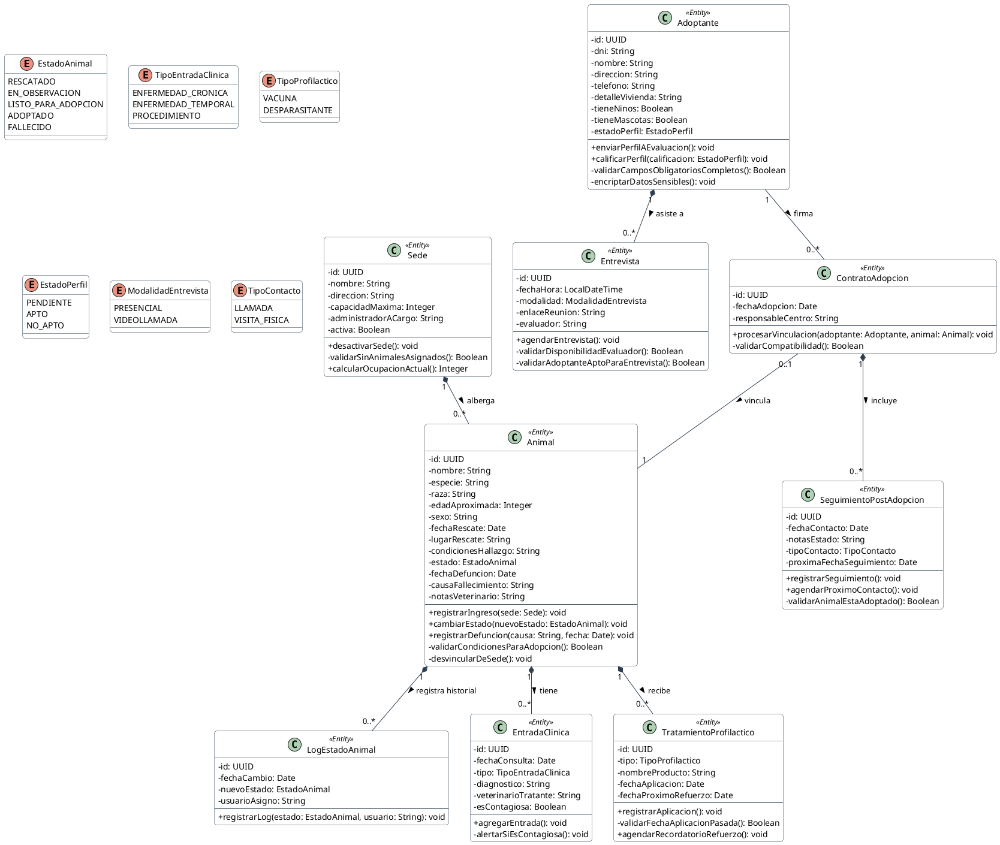

Class diagram:

```plantuml
@startuml Diagrama_Clases_WAO
skinparam classAttributeIconSize 0
skinparam shadowing false
skinparam roundcorner 10
skinparam class {
    BackgroundColor White
    ArrowColor #2c3e50
    BorderColor #2c3e50
}

' --- ENUMS ---
enum EstadoAnimal {
    RESCATADO
    EN_OBSERVACION
    LISTO_PARA_ADOPCION
    ADOPTADO
    FALLECIDO
}

enum TipoEntradaClinica {
    ENFERMEDAD_CRONICA
    ENFERMEDAD_TEMPORAL
    PROCEDIMIENTO
}

enum TipoProfilactico {
    VACUNA
    DESPARASITANTE
}

enum EstadoPerfil {
    PENDIENTE
    APTO
    NO_APTO
}

enum ModalidadEntrevista {
    PRESENCIAL
    VIDEOLLAMADA
}

enum TipoContacto {
    LLAMADA
    VISITA_FISICA
}

' --- CLASES DE ENTIDAD ---

class Sede <<Entity>> {
    - id: UUID
    - nombre: String
    - direccion: String
    - capacidadMaxima: Integer
    - administradorACargo: String
    - activa: Boolean
    --
    + desactivarSede(): void
    - validarSinAnimalesAsignados(): Boolean
    + calcularOcupacionActual(): Integer
}

class Animal <<Entity>> {
    - id: UUID
    - nombre: String
    - especie: String
    - raza: String
    - edadAproximada: Integer
    - sexo: String
    - fechaRescate: Date
    - lugarRescate: String
    - condicionesHallazgo: String
    - estado: EstadoAnimal
    - fechaDefuncion: Date
    - causaFallecimiento: String
    - notasVeterinario: String
    --
    + registrarIngreso(sede: Sede): void
    + cambiarEstado(nuevoEstado: EstadoAnimal): void
    + registrarDefuncion(causa: String, fecha: Date): void
    - validarCondicionesParaAdopcion(): Boolean
    - desvincularDeSede(): void
}

class LogEstadoAnimal <<Entity>> {
    - id: UUID
    - fechaCambio: Date
    - nuevoEstado: EstadoAnimal
    - usuarioAsigno: String
    --
    + registrarLog(estado: EstadoAnimal, usuario: String): void
}

class EntradaClinica <<Entity>> {
    - id: UUID
    - fechaConsulta: Date
    - tipo: TipoEntradaClinica
    - diagnostico: String
    - veterinarioTratante: String
    - esContagiosa: Boolean
    --
    + agregarEntrada(): void
    - alertarSiEsContagiosa(): void
}

class TratamientoProfilactico <<Entity>> {
    - id: UUID
    - tipo: TipoProfilactico
    - nombreProducto: String
    - fechaAplicacion: Date
    - fechaProximoRefuerzo: Date
    --
    + registrarAplicacion(): void
    - validarFechaAplicacionPasada(): Boolean
    + agendarRecordatorioRefuerzo(): void
}

class Adoptante <<Entity>> {
    - id: UUID
    - dni: String
    - nombre: String
    - direccion: String
    - telefono: String
    - detalleVivienda: String
    - tieneNinos: Boolean
    - tieneMascotas: Boolean
    - estadoPerfil: EstadoPerfil
    --
    + enviarPerfilAEvaluacion(): void
    + calificarPerfil(calificacion: EstadoPerfil): void
    - validarCamposObligatoriosCompletos(): Boolean
    - encriptarDatosSensibles(): void
}

class Entrevista <<Entity>> {
    - id: UUID
    - fechaHora: LocalDateTime
    - modalidad: ModalidadEntrevista
    - enlaceReunion: String
    - evaluador: String
    --
    + agendarEntrevista(): void
    - validarDisponibilidadEvaluador(): Boolean
    - validarAdoptanteAptoParaEntrevista(): Boolean
}

class ContratoAdopcion <<Entity>> {
    - id: UUID
    - fechaAdopcion: Date
    - responsableCentro: String
    --
    + procesarVinculacion(adoptante: Adoptante, animal: Animal): void
    - validarCompatibilidad(): Boolean
}

class SeguimientoPostAdopcion <<Entity>> {
    - id: UUID
    - fechaContacto: Date
    - notasEstado: String
    - tipoContacto: TipoContacto
    - proximaFechaSeguimiento: Date
    --
    + registrarSeguimiento(): void
    + agendarProximoContacto(): void
    - validarAnimalEstaAdoptado(): Boolean
}

' --- RELACIONES ---

Sede "1" *-- "0..*" Animal : alberga >
Animal "1" *-- "0..*" LogEstadoAnimal : registra historial >
Animal "1" *-- "0..*" EntradaClinica : tiene >
Animal "1" *-- "0..*" TratamientoProfilactico : recibe >

Adoptante "1" *-- "0..*" Entrevista : asiste a >
Adoptante "1" -- "0..*" ContratoAdopcion : firma >

ContratoAdopcion "0..1" -- "1" Animal : vincula >
ContratoAdopcion "1" *-- "0..*" SeguimientoPostAdopcion : incluye >

@enduml
```
