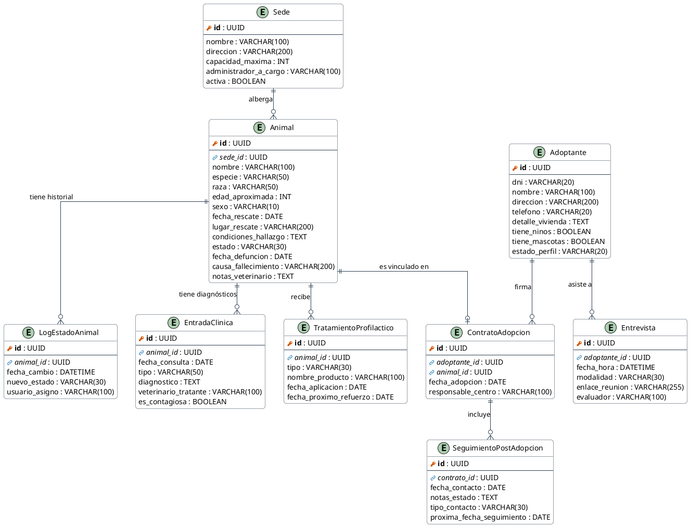

# ER Diagram:

```plantuml
@startuml
' Configuración visual
skinparam roundcorner 10
skinparam shadowing false
skinparam linetype ortho
skinparam class {
    BackgroundColor White
    ArrowColor #2c3e50
    BorderColor #2c3e50
}

' Macros para indicar Primary Key (PK) y Foreign Key (FK) con iconos
!define PK(x) <b><color:#d35400><&key></color> x</b>
!define FK(x) <color:#2980b9><&link-intact></color> <i>x</i>

entity "Sede" as sede {
  PK(id) : UUID
  --
  nombre : VARCHAR(100)
  direccion : VARCHAR(200)
  capacidad_maxima : INT
  administrador_a_cargo : VARCHAR(100)
  activa : BOOLEAN
}

entity "Animal" as animal {
  PK(id) : UUID
  --
  FK(sede_id) : UUID
  nombre : VARCHAR(100)
  especie : VARCHAR(50)
  raza : VARCHAR(50)
  edad_aproximada : INT
  sexo : VARCHAR(10)
  fecha_rescate : DATE
  lugar_rescate : VARCHAR(200)
  condiciones_hallazgo : TEXT
  estado : VARCHAR(30)
  fecha_defuncion : DATE
  causa_fallecimiento : VARCHAR(200)
  notas_veterinario : TEXT
}

entity "LogEstadoAnimal" as log_estado {
  PK(id) : UUID
  --
  FK(animal_id) : UUID
  fecha_cambio : DATETIME
  nuevo_estado : VARCHAR(30)
  usuario_asigno : VARCHAR(100)
}

entity "EntradaClinica" as clinica {
  PK(id) : UUID
  --
  FK(animal_id) : UUID
  fecha_consulta : DATE
  tipo : VARCHAR(50)
  diagnostico : TEXT
  veterinario_tratante : VARCHAR(100)
  es_contagiosa : BOOLEAN
}

entity "TratamientoProfilactico" as profilactico {
  PK(id) : UUID
  --
  FK(animal_id) : UUID
  tipo : VARCHAR(30)
  nombre_producto : VARCHAR(100)
  fecha_aplicacion : DATE
  fecha_proximo_refuerzo : DATE
}

entity "Adoptante" as adoptante {
  PK(id) : UUID
  --
  dni : VARCHAR(20)
  nombre : VARCHAR(100)
  direccion : VARCHAR(200)
  telefono : VARCHAR(20)
  detalle_vivienda : TEXT
  tiene_ninos : BOOLEAN
  tiene_mascotas : BOOLEAN
  estado_perfil : VARCHAR(20)
}

entity "Entrevista" as entrevista {
  PK(id) : UUID
  --
  FK(adoptante_id) : UUID
  fecha_hora : DATETIME
  modalidad : VARCHAR(30)
  enlace_reunion : VARCHAR(255)
  evaluador : VARCHAR(100)
}

entity "ContratoAdopcion" as contrato {
  PK(id) : UUID
  --
  FK(adoptante_id) : UUID
  FK(animal_id) : UUID
  fecha_adopcion : DATE
  responsable_centro : VARCHAR(100)
}

entity "SeguimientoPostAdopcion" as seguimiento {
  PK(id) : UUID
  --
  FK(contrato_id) : UUID
  fecha_contacto : DATE
  notas_estado : TEXT
  tipo_contacto : VARCHAR(30)
  proxima_fecha_seguimiento : DATE
}

' Relaciones ER (Notación Pata de Cuervo)
' ||--o{  Significa: 1 a muchos (cero o muchos)
' ||--o|  Significa: 1 a cero o 1

sede ||--o{ animal : "alberga"
animal ||--o{ log_estado : "tiene historial"
animal ||--o{ clinica : "tiene diagnósticos"
animal ||--o{ profilactico : "recibe"

adoptante ||--o{ entrevista : "asiste a"
adoptante ||--o{ contrato : "firma"
animal ||--o| contrato : "es vinculado en"

contrato ||--o{ seguimiento : "incluye"

@enduml
```
