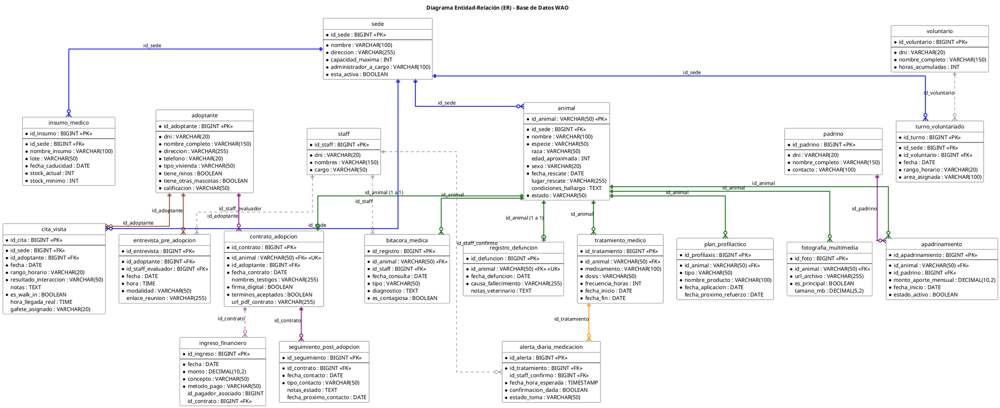

# ER Diagram:

```plantuml
@startuml Diagrama_ER_WAO
' Configuración visual para diagrama ER
hide circle
skinparam linetype ortho
skinparam roundcorner 5
skinparam class {
    BackgroundColor White
    BorderColor Black
    ArrowColor Black
}

title Diagrama Entidad-Relación (ER) - Base de Datos WAO

' ==========================================
' TABLAS DE ADMINISTRACIÓN (Multi-Sede)
' ==========================================
entity "sede" as sede {
  * id_sede : BIGINT <<PK>>
  --
  * nombre : VARCHAR(100)
  * direccion : VARCHAR(255)
  * capacidad_maxima : INT
  * administrador_a_cargo : VARCHAR(100)
  * esta_activa : BOOLEAN
}

entity "staff" as staff {
  * id_staff : BIGINT <<PK>>
  --
  * dni : VARCHAR(20)
  * nombres : VARCHAR(150)
  * cargo : VARCHAR(50)
}

entity "ingreso_financiero" as ingreso {
  * id_ingreso : BIGINT <<PK>>
  --
  * fecha : DATE
  * monto : DECIMAL(10,2)
  * concepto : VARCHAR(50)
  * metodo_pago : VARCHAR(50)
  id_pagador_asociado : BIGINT
  id_contrato : BIGINT <<FK>> 
}

' ==========================================
' TABLAS DE GESTIÓN DE ANIMALES
' ==========================================
entity "animal" as animal {
  * id_animal : VARCHAR(50) <<PK>>
  --
  * id_sede : BIGINT <<FK>>
  * nombre : VARCHAR(100)
  * especie : VARCHAR(50)
  raza : VARCHAR(50)
  edad_aproximada : INT
  * sexo : VARCHAR(20)
  * fecha_rescate : DATE
  lugar_rescate : VARCHAR(255)
  condiciones_hallazgo : TEXT
  * estado : VARCHAR(50)
}

entity "fotografia_multimedia" as fotografia {
  * id_foto : BIGINT <<PK>>
  --
  * id_animal : VARCHAR(50) <<FK>>
  * url_archivo : VARCHAR(255)
  * es_principal : BOOLEAN
  tamano_mb : DECIMAL(5,2)
}

entity "registro_defuncion" as defuncion {
  * id_defuncion : BIGINT <<PK>>
  --
  * id_animal : VARCHAR(50) <<FK>> <<UK>>
  * fecha_defuncion : DATE
  * causa_fallecimiento : VARCHAR(255)
  notas_veterinario : TEXT
}

' ==========================================
' TABLAS DE SALUD Y VETERINARIA
' ==========================================
entity "bitacora_medica" as bitacora {
  * id_registro : BIGINT <<PK>>
  --
  * id_animal : VARCHAR(50) <<FK>>
  * id_staff : BIGINT <<FK>>
  * fecha_consulta : DATE
  * tipo : VARCHAR(50)
  * diagnostico : TEXT
  * es_contagiosa : BOOLEAN
}

entity "plan_profilactico" as profilaxis {
  * id_profilaxis : BIGINT <<PK>>
  --
  * id_animal : VARCHAR(50) <<FK>>
  * tipo : VARCHAR(50)
  * nombre_producto : VARCHAR(100)
  * fecha_aplicacion : DATE
  fecha_proximo_refuerzo : DATE
}

entity "tratamiento_medico" as tratamiento {
  * id_tratamiento : BIGINT <<PK>>
  --
  * id_animal : VARCHAR(50) <<FK>>
  * medicamento : VARCHAR(100)
  * dosis : VARCHAR(50)
  * frecuencia_horas : INT
  * fecha_inicio : DATE
  * fecha_fin : DATE
}

entity "alerta_diaria_medicacion" as alerta {
  * id_alerta : BIGINT <<PK>>
  --
  * id_tratamiento : BIGINT <<FK>>
  id_staff_confirmo : BIGINT <<FK>>
  * fecha_hora_esperada : TIMESTAMP
  * confirmacion_dada : BOOLEAN
  * estado_toma : VARCHAR(50)
}

entity "insumo_medico" as insumo {
  * id_insumo : BIGINT <<PK>>
  --
  * id_sede : BIGINT <<FK>>
  * nombre_insumo : VARCHAR(100)
  * lote : VARCHAR(50)
  * fecha_caducidad : DATE
  * stock_actual : INT
  * stock_minimo : INT
}

' ==========================================
' TABLAS DE ADOPCIONES Y PADRINOS
' ==========================================
entity "adoptante" as adoptante {
  * id_adoptante : BIGINT <<PK>>
  --
  * dni : VARCHAR(20)
  * nombre_completo : VARCHAR(150)
  * direccion : VARCHAR(255)
  * telefono : VARCHAR(20)
  * tipo_vivienda : VARCHAR(50)
  * tiene_ninos : BOOLEAN
  * tiene_otras_mascotas : BOOLEAN
  * calificacion : VARCHAR(50)
}

entity "contrato_adopcion" as contrato {
  * id_contrato : BIGINT <<PK>>
  --
  * id_animal : VARCHAR(50) <<FK>> <<UK>>
  * id_adoptante : BIGINT <<FK>>
  * fecha_contrato : DATE
  nombres_testigos : VARCHAR(255)
  * firma_digital : BOOLEAN
  * terminos_aceptados : BOOLEAN
  url_pdf_contrato : VARCHAR(255)
}

entity "seguimiento_post_adopcion" as seguimiento {
  * id_seguimiento : BIGINT <<PK>>
  --
  * id_contrato : BIGINT <<FK>>
  * fecha_contacto : DATE
  * tipo_contacto : VARCHAR(50)
  notas_estado : TEXT
  fecha_proximo_contacto : DATE
}

entity "padrino" as padrino {
  * id_padrino : BIGINT <<PK>>
  --
  * dni : VARCHAR(20)
  * nombre_completo : VARCHAR(150)
  * contacto : VARCHAR(100)
}

entity "apadrinamiento" as apadrinamiento {
  * id_apadrinamiento : BIGINT <<PK>>
  --
  * id_animal : VARCHAR(50) <<FK>>
  * id_padrino : BIGINT <<FK>>
  * monto_aporte_mensual : DECIMAL(10,2)
  * fecha_inicio : DATE
  * estado_activo : BOOLEAN
}

' ==========================================
' TABLAS DE VISITAS Y AGENDA
' ==========================================
entity "cita_visita" as cita {
  * id_cita : BIGINT <<PK>>
  --
  * id_sede : BIGINT <<FK>>
  * id_adoptante : BIGINT <<FK>>
  * fecha : DATE
  * rango_horario : VARCHAR(20)
  * resultado_interaccion : VARCHAR(50)
  notas : TEXT
  * es_walk_in : BOOLEAN
  hora_llegada_real : TIME
  gafete_asignado : VARCHAR(20)
}

entity "entrevista_pre_adopcion" as entrevista {
  * id_entrevista : BIGINT <<PK>>
  --
  * id_adoptante : BIGINT <<FK>>
  * id_staff_evaluador : BIGINT <<FK>>
  * fecha : DATE
  * hora : TIME
  * modalidad : VARCHAR(50)
  enlace_reunion : VARCHAR(255)
}

entity "voluntario" as voluntario {
  * id_voluntario : BIGINT <<PK>>
  --
  * dni : VARCHAR(20)
  * nombre_completo : VARCHAR(150)
  * horas_acumuladas : INT
}

entity "turno_voluntariado" as turno {
  * id_turno : BIGINT <<PK>>
  --
  * id_sede : BIGINT <<FK>>
  * id_voluntario : BIGINT <<FK>>
  * fecha : DATE
  * rango_horario : VARCHAR(20)
  * area_asignada : VARCHAR(100)
}

' ==========================================
' RELACIONES (Notación Crow's Foot / Pata de gallo)
' ==========================================

' Sede -> (Animal, Insumos, Citas, Turnos)
sede ||-[#blue,bold]-o{ animal : "id_sede"
sede ||-[#blue,bold]-o{ insumo : "id_sede"
sede ||-[#blue,bold]-o{ cita : "id_sede"
sede ||-[#blue,bold]-o{ turno : "id_sede"

' Animal -> (Hijos)
animal ||-[#006400,bold]-o{ fotografia : "id_animal"
animal ||-[#006400,bold]-o| defuncion : "id_animal (1 a 1)"
animal ||-[#006400,bold]-o{ bitacora : "id_animal"
animal ||-[#006400,bold]-o{ profilaxis : "id_animal"
animal ||-[#006400,bold]-o{ tratamiento : "id_animal"
animal ||-[#006400,bold]-o| contrato : "id_animal (1 a 1)"
animal ||-[#006400,bold]-o{ apadrinamiento : "id_animal"

' Veterinaria
tratamiento ||-[#FF8C00,bold]-o{ alerta : "id_tratamiento"

' Staff (Relaciones de auditoría)
staff ||-[#696969,dashed]-o{ bitacora : "id_staff"
staff ||-[#696969,dashed]-o{ alerta : "id_staff_confirmo"
staff ||-[#696969,dashed]-o{ entrevista : "id_staff_evaluador"

' Adopciones y Padrinos
adoptante ||-[#800080,bold]-o{ contrato : "id_adoptante"
contrato ||-[#800080,bold]-o{ seguimiento : "id_contrato"
padrino ||-[#800080,bold]-o{ apadrinamiento : "id_padrino"
contrato ||-[#800080,dashed]-o{ ingreso : "id_contrato"

' Adoptante -> Visitas
adoptante ||-[#8B4513,bold]-o{ cita : "id_adoptante"
adoptante ||-[#8B4513,bold]-o{ entrevista : "id_adoptante"

' Voluntariado
voluntario ||-[#696969,dashed]-o{ turno : "id_voluntario"

@enduml
```
